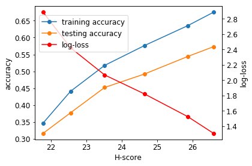

# Validation of H-score
To demonstrate that H-score is indeed a suitable measurement for transfer performance, we compare H-score with the empirical 
performance of transfering representations learned from ImageNet 1000-class classification (Krizhevsky et al. (2012)) on Cifar
100-class classification (Krizhevsky & Hinton(2009)). 
## Experiment Steps
### Step 1: Data Preprocessing and Feature Extracting 
We divide Cifar-100 dataset into 6 parts. Each part contains 10k images.

We resize Cifar-100 images into the same shape as the ResNet-50 input shape, i.e., (224,224,3).

We extract features separately from ResNet-50 layer res4a_relu, res4b_relu,...,res4f_relu 
(For Resnet-50 structure, you can refer to http://ethereon.github.io/netscope/#/gist/db945b393d40bfa26006.). 
And the extraceted feature shape is (1024,14,14). For the convenience of computation and comparison of H-scores, 
we do AveragePooling2D((14, 14)) to the extracted feature. In all, we obtain 6 1024-dimension features for each sample.   

You can download the extracted feature at https://pan.baidu.com/s/1ikJU2Fe-37P71jnYVjA0CA or 
extract features by running transfer_feature_4a-4f.py. Anyway, you should put the extracted features in Folder 224_resnet50_cifar.

### Step 2: Computing Empirical Performance and H-scores
You can run H-score_vs_performance.py to reproduce our results. 

  

